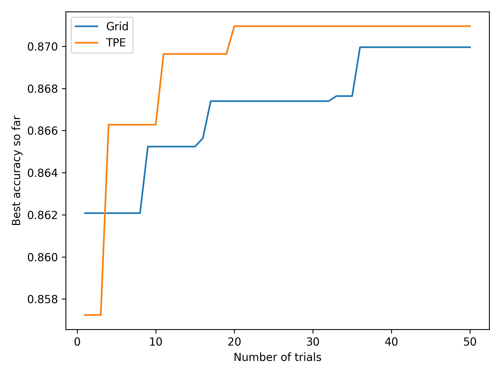

# Lab 2: Neural Architecture Search

## Task 1

> Explore using the `GridSampler` and `TPESampler` in Optuna.

`GridSampler` is the simplest sampler available. It searches the space exhaustively by evaluating the objective function for all configurations. The evaluation order is random and decided when `GridSampler` is called. It does not leverage any information obtained during trials. This method is infeasible for a large number of dimensions because of the combinatorial explosion of the search space.

`TPESampler` is another sampler which uses information from past trials. First, `n_startup_trials` are random and used for initial exploration. After that, `TPESampler` models the search space by fitting two probability distributions over the parameters: one "good" (low objective values) and one "bad" (high objective values). The parameter γ, defined as
`γ(n) = min(ceil(0.1 × n), 25)`,
decides how many trials are considered good. By default, the best 10% of trials are treated as good up to the 250th trial, after which this is fixed to the best 25 trials. New configurations are then sampled by maximising the ratio ( l(x) / g(x) ), which favours regions of the search space that are more likely to yield improved objective values. Unlike `GridSampler`, this approach adapts the search based on observed results, making it significantly more sample-efficient and better suited to high-dimensional or continuous search spaces.

> Plot a figure that has the number of trials on the x-axis, and the maximum achieved accuracy up to that point on the y-axis. Plot one curve for each sampler to compare their performance.

### Plot

### Analysis

The results show that TPE outperforms grid search. This is expected because the search space is large(grid didn't get good configurations in the first 50 trials). Also, TPE curve shows a significant jump right after the 10th iteration when TPE starts actual optimisation.

---

## Task 2

> In Tutorial 5, NAS is used to find an optimal configuration of hyperparameters, then we use the `CompressionPipeline` in MASE to quantize and prune the model after search is finished. However, the final compressed model may not be optimal, since different model architectures may have different sensitivities to quantization and pruning. Ideally, we want to run a compression-aware search flow, where the quantization and pruning is considered in each trial.

> In the objective function, after the model is constructed and trained for some iterations, call the `CompressionPipeline` to quantize and prune the model, then continue training for a few more epochs. Use the sampler that yielded the best results in Task 1 to run the compression-aware search. The objective function should return the final accuracy of the model after compression. Consider also the case where final training is performed after quantization/pruning.

TODO: INSERT CODE SNIPPET of objective function with pruning

> Plot a new figure that has the number of trials on the x-axis, and the maximum achieved accuracy up to that point on the y-axis. There should be three curves:
> 1. The best performance from Task 1 (without compression)
> 2. Compression-aware search without post-compression training
> 3. Compression-aware search with post-compression training

### Plot

### Analysis
